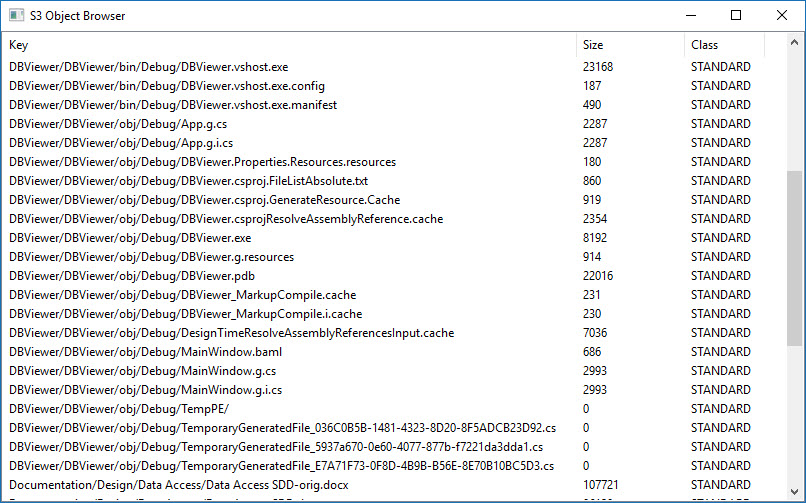

# CloudSync
Python program to sync local files and folders to a Cloud repository, such as Amazon S3

## Introduction
CloudSync is a command line Python script which data between 
repositories.  A repository is a place where files and folders are 
stored.  This can be a local hard drive on a system, a folder on a 
remote file server, or a cloud-based server, such as Amazon S3. 
Data in a repository is organized into files and folders.  

## S3Browser
Currently, this is the only partially functioning application in this project.  This is a GUI app
which shows the contents of an S3 bucket.

### Usage

    usage: S3Browser.py [-h] [--bucket BUCKET] [--refresh]

    S3 object browser

    optional arguments:
      -h, --help       show this help message and exit
      --bucket BUCKET  Name of bucket browse
      --refresh        Refresh local cached database from S3 storage
      
### Screenshot

